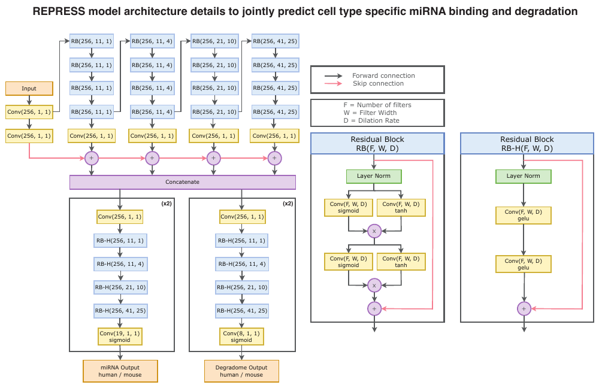
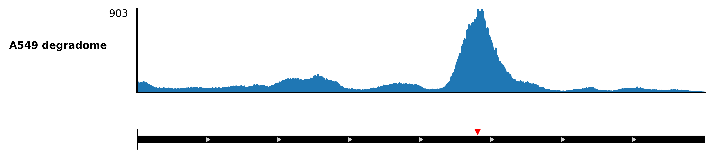

# REPRESS: A Deep Learning Model for Cell-Type-Specific Post-Transcriptional Gene Regulation

**REPRESS** (Regulatory Element PRediction of post-transcriptional Events using Sequence Signals) is a deep learning model that predicts cell-type-specific microRNA (miRNA) binding and mRNA degradation directly from RNA sequence.

Trained on millions of sites from AGO2-CLIP, miR-eCLIP, and Degradome-Seq data across multiple human and mouse cell types, REPRESS learns rich representations of post-transcriptional gene regulation. It captures both canonical and non-canonical miRNA binding, integrates sequence context and site multiplicity, and generalizes across tissues and modalities. The version of REPRESS released in this repository has 8356199 parameters with the list of AGO2-CLIP, miR-eCLIP and Degradome-Seq cell lines shown in the `Published Datasets used for model training` section below.

## Key Features
- Predicts **miRNA binding** and **mRNA degradation** at single-nucleotide resolution
- Captures **cell-type-specific regulatory signals** using endogenous sequence features
- Learns **non-canonical targeting rules** and **contextual repression mechanisms**
- Outperforms prior methods on 7 orthogonal benchmarks, including:
  - Variant effect prediction on miRNA binding
  - Out-of-distribution generalization to reporter assay data
  - Discovery of novel repressive elements across transcripts

## Applications
- Functional annotation of non-coding variants
- Mechanistic insights into miRNA and RBP interactions
- Rational design of RNA therapeutics

## Model Architecture



## Prerequisites
- [Anaconda](https://www.anaconda.com/products/distribution) or [Mamba](https://mamba.readthedocs.io/en/latest/) (Python ≥3.8)
- Optional (for GPU support):
  - NVIDIA GPU with a driver that supports CUDA ≥11.2
  - Note: The CUDA toolkit and cuDNN libraries are automatically installed in the Conda environment; no system-wide CUDA installation is needed.
- **Other Tools**
  - `wget` (used to download initial data).

## Steps to setup environment
The following commands will create a Conda environment, install required packages, and set up the project. GPU support will be enabled automatically if compatible hardware and drivers are present.

> **Note:** The commands below use `mamba` for faster dependency resolution. You may substitute `mamba` with `conda` if preferred.

```bash
# Create the environment from the environment.yml file
mamba env create -f environment.yml

# Activate the environment
mamba activate repress

# Install the project in editable mode
pip install -e .

# Make the build script executable and run it
chmod +x build.sh
./build.sh
```

## Run Analyses
All data required for the analyses with be under the `data/` subfolder in each of the analysis and resulting plots will be under the `plots/` folder.

```bash
# Run REPRESS to generate track plots and ISM for UTRN example
python repress/track_plots_and_ism_analysis/generate_track_plots_and_ism.py

# Run REPRESS to generate degradome predictions for ENO2
python repress/degradome_prediction_analysis/generate_degradome_predictions.py

# Run REPRESS on Slutskin MPRA analysis
python repress/slutskin_mpra_analysis/repress_slutskin_mpra_analysis.py

# Run REPRESS to generate wild type and mutant tracks with variant or oligo treatement
python repress/oligo_track_plots_analysis/generate_oligo_variant_tracks.py

# Run REPRESS on miRNA variant effect prediction analysis
python repress/variant_effect_prediction_analysis/get_variant_predictions.py
python repress/variant_effect_prediction_analysis/plot_variant_analysis.py
```

## Usage
> **Note:** The following code must be executed from the repository root.

```python
import os
from genome_kit import Genome
import matplotlib.pyplot as plt

from repress.plot_tracks import make_track_plot
from repress.model_wrapper import REPRESS

# ------------------------------------------------------------------
# 1. Load a REPRESS model and its associated cell-line metadata
# ------------------------------------------------------------------
#   - "repress/repress_model"       → directory in repo with weights
#   - "repress/cell_line_csv.csv"   → CSV mapping cell-line names to indices
model = REPRESS(
    path="repress/repress_model",
    cell_type_csv="repress/cell_line_csv.csv"
)

# ------------------------------------------------------------------
# 2. Set up reference genome and locate the region of interest
# ------------------------------------------------------------------
# Load GENCODE v29 reference genome annotation
genome = Genome("gencode.v29")

# Gene we care about
gene_name = "ENO2"

# Get the Gene object for ENO2
# (Genome.genes is an iterable of Gene objects)
gene = [g for g in genome.genes if g.name == gene_name][0]

# Choose a specific transcript (second isoform in the list)
transcript = gene.transcripts[1]

# Grab the first 3′-UTR interval of that transcript
utr3 = transcript.utr3s[0]

# ------------------------------------------------------------------
# 3. Choose the cell line context for the prediction
# ------------------------------------------------------------------
cell_line = "deg_A549"          # must match an entry in cell_line_csv

# ------------------------------------------------------------------
# 4. Run the model on the interval
# ------------------------------------------------------------------
# predict_interval returns a list (one score per input interval);
# we take the first element because we passed a single interval
prediction_score = model.predict_interval(
    interval=utr3,  # Interval / Intervals of interest.
    genome=genome,  # Genome of the species of interest.
    transcript=transcript,  # transcript(s) that the intervals belongs to
    cell_lines=cell_line  # A list of length k corresponding to the cell lines to be included in the output
)[0]

# ------------------------------------------------------------------
# 5. Plot the degradome prediction tracks
# ------------------------------------------------------------------
fig, ax = make_track_plot(utr3, prediction_score, gene, genome, figsize=(8, 2),
                        scale_marker=0.4, custom_transcript=transcript,
                        vertical_markers=[6923337], vertical_markers_colors=["red"],
                        ylabels=["A549 degradome"], labelpad=40,)

os.makedirs("temporary_plots", exist_ok=True)
plt.savefig("temporary_plots/ENO2_degradome_track_plot.png", dpi=600, bbox_inches="tight")
plt.close()
```




## Published Datasets used for model training


### Datasets used for miRNA binding components of REPRESS.
| Name | GSE | Study&nbsp;ID | GSM&nbsp;ID | SRX&nbsp;ID | Protocol | Aligner | Type | Species | Notes | Source |
| --- | --- | --- | --- | --- | --- | --- | --- | --- | --- | --- |
| BC1 | GSE32109 | PRJNA154855 | GSM796037, GSM796038 | SRX097115, SRX097116 | PAR-CLIP | bowtie1 | bcell | human |  | Previously&nbsp;Published |
| BC3 | GSE32109 | PRJNA154855 | GSM796039, GSM796040 | SRX097117, SRX097118 | PAR-CLIP | bowtie1 | bcell | human |  | Previously&nbsp;Published |
| BCBL | GSE43909 | PRJNA188176 | GSM1074233, GSM1074234 | SRX220837, SRX220838 | PAR-CLIP | bowtie1 | bcell | human |  | Previously&nbsp;Published |
| DG75 | GSE43909 | PRJNA188176 | GSM1074231, GSM1074232 | SRX220835, SRX220836 | PAR-CLIP | bowtie1 | bcell | human |  | Previously&nbsp;Published |
| HEK293 | GSE28859 | PRJNA153959 | GSM714646, GSM714647 | SRX058621, SRX058622 | PAR-CLIP | bowtie1 | kidney | human |  | Previously&nbsp;Published |
| HeLa | GSE29943 | PRJNA140779 | GSM741173, GSM741174, GSM741175 | SRX083305, SRX083306, SRX083307 | PAR-CLIP | bowtie1 | cervix | human |  | Previously&nbsp;Published |
| A2780 | GSE129076 | PRJNA529911 | GSM3693008, GSM3693009 | SRX5604726, SRX5604726 | PAR-CLIP | bowtie1 | ovary | human |  | Previously&nbsp;Published |
| MCF7 |  | PRJNA230871 |  | SRX388831 | PAR-CLIP | bowtie1 | breast | human |  | Previously&nbsp;Published |
| hESC |  | PRJNA80179 |  | SRX103431 | PAR-CLIP | bowtie1 | stem | human |  | Previously&nbsp;Published |
| A673 | GSE80494 | PRJNA319049 |  | SRX1716186, SRX1716187 | PAR-CLIP | bowtie1 | muscle | human |  | Previously&nbsp;Published |
| 22RV1 | GSE137072 | PRJNA564505 | GSM4066540, GSM4066541, GSM4066542 | SRX6817511, SRX6817512, SRX6817513 | HITS-CLIP | bowtie2 | prostate | human |  | Previously&nbsp;Published |
| HCT116 | GSE146688 | PRJNA611621 | GSM4404081, GSM4404082 | SRX7883128, SRX7883129 | eCLIP | bowtie2 | colon | human |  | Previously&nbsp;Published |
| Huh7 | GSE73057 | PRJNA295996 |  |  | CLEAR-CLIP | star | liver | human |  | Previously&nbsp;Published |
| A549 |  |  |  |  | miR-eCLIP | star | lung | human |  | This&nbsp;Study |
| K562 |  |  |  |  | miR-eCLIP | star | bone | human |  | This&nbsp;Study |
| HEK293T |  |  |  |  | miR-eCLIP | star | kidney | human |  | Previously&nbsp;Published |
| Mouse ESC | GSE108795 | PRJNA428611 | GSM2913321, GSM2913322 | SRX3533994, SRX3533995 | PAR-CLIP | bowtie1 | stem | mouse | mouse embryonic stem cells | Previously&nbsp;Published |
| Mouse myotubes | GSE108795 | PRJNA428611 | GSM2913323, GSM2913324 | SRX3533996, SRX3533997 | PAR-CLIP | bowtie1 | muscle | mouse | cells differentiated from Myoblast → Myotubes | Previously&nbsp;Published |
| Mouse BMDM | GSE63199 | PRJNA266979 | GSM1543768 | SRX758007 | PAR-CLIP | bowtie1 | bone marrow | mouse | C57BL/6 mouse | Previously&nbsp;Published |
| Mouse retina | GSE165832 | PRJNA697981 | GSM5050738, GSM5050741 | SRX9980473, SRX9980474 | PAR-CLIP | bowtie1 | retina | mouse | CD-1 mice, P0 | Previously&nbsp;Published |
| Mouse brain | GSE129885 | PRJNA533090 | GSM3724178 | SRX5694011 | eCLIP | star | brain | mouse | C57BL/6 mouse, P0 | Previously&nbsp;Published |
| Mouse iNeuron | GSE140838 | PRJNA591126 | GSM4188573 | SRX7202046 | seCLIP | star | CNS | mouse | ESC, day 10 differentiation | Previously&nbsp;Published |
| Mouse liver |  |  |  |  | miR-eCLIP | star | liver | mouse | C57BL/6J mouse, 8-week-old | Previously&nbsp;Published |

### Datasets used for mRNA degradation components of REPRESS.

| Cell Line             |   Num Reps | Protocol      | Aligner   | Type   | Species   | Source     |
|:----------------------|-----------:|:--------------|:----------|:-------|:----------|:-----------|
| A549                  |          4 | Degradome-Seq | star      | lung   | human     | This Study |
| HepG2                 |          3 | Degradome-Seq | star      | liver  | human     | This Study |
| iNeuron glutamatergic |          3 | Degradome-Seq | star      | CNS    | human     | This Study |
| K562                  |          3 | Degradome-Seq | star      | bone   | human     | This Study |
| PHH                   |          6 | Degradome-Seq | star      | liver  | human     | This Study |
| Yecuris liver         |          3 | Degradome-Seq | star      | liver  | human     | This Study |
| Mouse cortex          |          3 | Degradome-Seq | star      | brain  | mouse     | This Study |
| Mouse liver           |          3 | Degradome-Seq | star      | liver  | mouse     | This Study |
| Mouse cns e18 day4    |          3 | Degradome-Seq | star      | CNS    | mouse     | This Study |
| Mouse cns e18 day11   |          3 | Degradome-Seq | star      | CNS    | mouse     | This Study |

## License

This material is released under the Creative Commons Attribution-NonCommercial 4.0 International (CC BY-NC 4.0) license. If you use this software or data in your non-commercial work, please cite our paper [1].

For inquiries regarding commercial use please contact: legal@deepgenomics.com. Deep Genomics has filed one or more patent applications related to technical aspects of this work including PCT/IB2025/052017.


## Citing this work
If you use REPRESS in your research, please cite:

```
@article{Kanuparthi2025.05.15.654105,
	author = {Kanuparthi, Bhargav and Pour, Sara E. and Findlay, Scott D. and Wagih, Omar and Gutierrez, Jahir M. and Gao, Rory and Wintersinger, Jeff and Lin, Junru and Gabra, Martino and Bohn, Emma and Lau, Tammy and Cole, Christopher B and Jung, Andrew and Celaj, Albi and Soares, Fraser and Gray, Rachel and Vaz, Brandon and Delfosse, Kate and Lodaya, Varun and Bhargava, Sakshi and Ly, Diane and Yusuf, Farhan and Kron, Ken and Hoffman, Greg and Gandhi, Shreshth and Frey, Brendan J.},
	title = {Sequence based prediction of cell type specific microRNA binding and mRNA degradation for therapeutic discovery},
	elocation-id = {2025.05.15.654105},
	year = {2025},
	doi = {10.1101/2025.05.15.654105},
	publisher = {Cold Spring Harbor Laboratory},
	URL = {https://www.biorxiv.org/content/early/2025/05/16/2025.05.15.654105},
	eprint = {https://www.biorxiv.org/content/early/2025/05/16/2025.05.15.654105.full.pdf},
	journal = {bioRxiv}
}
```
